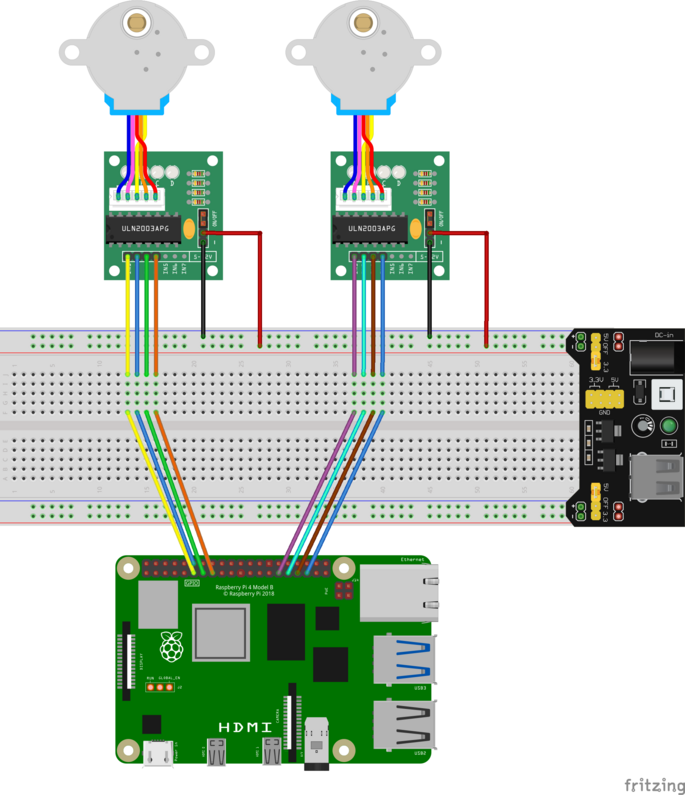

# stepper-motors

Golang  stepper motor library for Raspberry Pi.

## Installation

````bash
go get -u github.com/euphoria-laxis/stepper-motors
````

## Usages

### Prerequisites

To run this library you first need to initialize **GPIO**. This library uses 
[stianeikeland/go-rpio/v4](https//github.com/stianeikeland/go-rpio), you can visit 
this repository for more information. To initialize pins you can do like this:

````go
package main

import (
    "log"
	
    "github.com/stianeikeland/go-rpio/v4"
)

func main () {
    if err := rpio.Open(); err != nil {
        log.Fatal("rpio.Open() failed")
    }
}
````

Don't forget to close the library once you've finished using it. To do it just add :

````go
package main

import (
    "log"
	
    "github.com/stianeikeland/go-rpio/v4"
)

func main () {
    err := rpio.Open()
    if err != nil {
        log.Fatal("rpio.Open() failed")
    }
    // ...
    // Your own stuff...
    // ...
    err = rpio.Close()
    if err != nil {
        log.Fatal("rpio.Close() failed")
    }
}
````

### Running a stepper motor

The struct `StepperMotor` musts always be initialised using the 'constructor' 
`NewStepperMotor`. The only required parameter is a function to set GPIO you
want to use *(GPIO pins are set using BCM numbers)* as following :

````go
package main

import (
	"log"

	"github.com/euphoria-laxis/stepper-motors/stepper"
)

func main () {
	var smgpios = [4]int{17, 18, 27, 22}
	// Create stepper.StepperMotor instance
	sm := stepper.NewStepperMotor(
		stepper.SetGPIOs(smgpios),
	)
}
````

Once created you can run the stepper motor using the method 
`Run(direction Direction, angle uint, speed Speed)`. The parameters structs `Direction`
and `Speed` values can be found in the library.

* **Direction** values :
  * `DirectionClock`
  * `DirectionCounterClock`
* **Speed** values :
  * `Speed20`
  * `Speed40`
  * `Speed60`
  * `Speed80`
  * `Speed100`

You can run the method as following :

````go
package main

import (
	"log"
	"time"

	"github.com/euphoria-laxis/stepper-motors/stepper"
)

func main () {
	var smgpios = [4]int{17, 18, 27, 22}
	// Create stepper.StepperMotor instance
	sm := stepper.NewStepperMotor(
		stepper.SetGPIOs(smgpios),
	)
	sm.Run(stepper.DirectionClock, 180, stepper.Speed40)
	stepper.Wait(1 * time.Second) // wait 1sec after running the stepper motor
}
````

This will rotate the motor forward (clockwise) to 180° at 40% speed.

### Examples

You can check the examples in [examples folder](./examples). To run the examples you will
have to connect the stepper motors to your raspberry pi as following :



You will need to ruin the binary with **root privileges** to access the GPIOs. To build the
examples and run them just use :

````bash
mkdir build
go build -o build/two_steppers examples/two_steppers/two_steppers.go
./build/two_steppers # don't forget to run this with root privileges.
````

This should move the 2 stepper motors at 270°.

## Contribution

This library is maintained by [Euphoria Laxis](https://github.com/euphoria-laxis).

You are free to contribute by submitting a pull request, I will review it before merging,
I might contact you if I need more information before merging the PR into the main branch.

## LICENSE

This project is under [MIT License](./LICENSE).
